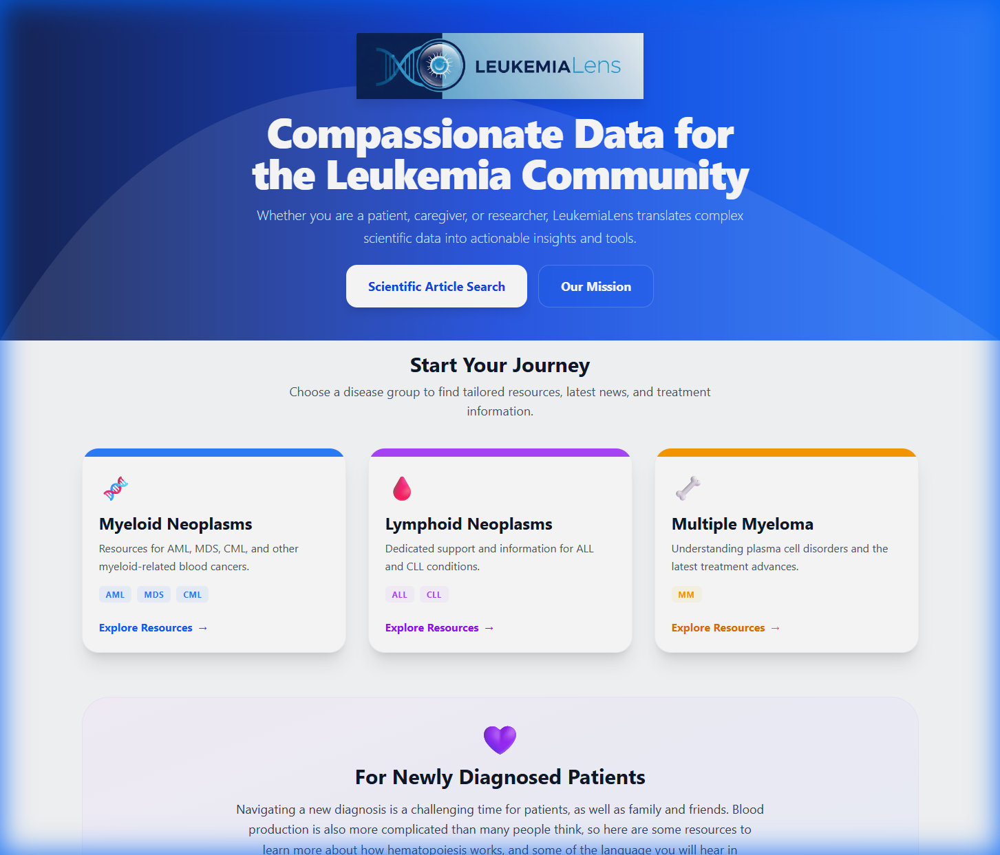
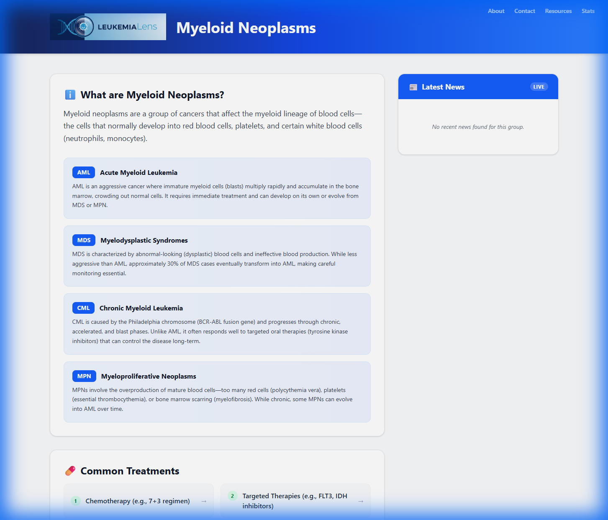
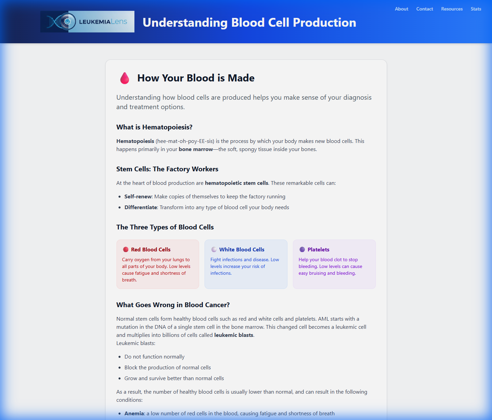
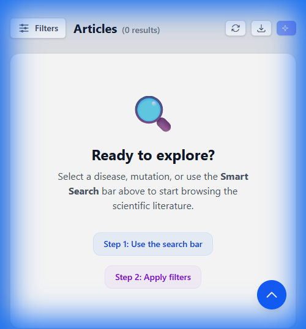
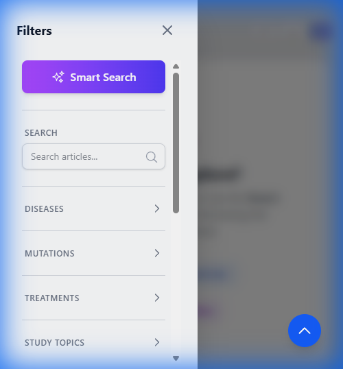

# LeukemiaLens

LeukemiaLens is a specialized research tracker designed to help researchers and clinicians stay updated with the latest scientific developments in leukemia. It aggregates articles from PubMed and enriches them with intelligent tagging for specific gene mutations, disease subtypes, research topics, and clinical treatments.

## Screenshots

### Landing Page & Disease Navigation
The redesigned landing page welcomes patients, caregivers, and researchers with intuitive navigation to disease-specific resources.


### Disease-Specific Resource Pages
Each disease group (Myeloid, Lymphoid, Myeloma) has dedicated pages with curated information, treatment options, live news feeds, and clinical trial links.


### Educational Content for Newly Diagnosed Patients
Patient-friendly educational pages explain complex topics like blood cell production, mutations, risk stratification, and stem cell transplants.


### Advanced Filtering & Study Topics
Powerful filtering for scientific articles with multi-select mutations, diseases, treatments, and research topics.


### Responsive Mobile Design
LeukemiaLens is fully optimized for mobile devices, featuring a collapsible filter drawer to maximize screen space for research content.

| Mobile Article List | Mobile Filter Drawer |
| :---: | :---: |
|  |  |

## Features

### For Researchers & Clinicians
- **Automated Data Ingestion**: Scheduled workers fetch recent scientific articles from PubMed (NCBI) matching leukemia-related queries.
- **Smart Tagging**:
  - **Mutations**: Automatically detects 65+ gene mutations based on ELN 2022 (AML) and WHO 2022 (ALL) standards, including risk-stratifying markers (NPM1, FLT3-ITD, TP53), MDS-related genes (ASXL1, BCOR, SF3B1), fusion genes (BCR-ABL1, PML-RARA, KMT2A), and ALL-specific alterations.
  - **Diseases**: Categorizes articles by subtype (AML, CML, ALL, CLL, MDS, MPN, DLBCL, MM).
  - **Study Topics**: Identifies key research areas like CAR-T, Cell Therapy, Immunotherapy, Clinical Trials, and Data Science/AI.
  - **Treatments**: Detects specific pharmacological treatments and established protocols (e.g., 7+3, VEN-AZA, FLAG-IDA).
- **Grouped Mutation Filter**: Toggle between functional category view (Kinase, Epigenetic, Fusion, etc.) or ELN 2022 risk classification (Favorable, Intermediate, Adverse) with collapsible sections and help tooltip.
- **Ontology-Based Filtering**: Reference tables ensure consistent disease, mutation, and treatment classification.
- **AI-Powered Features**:
  - **Smart Search**: Natural language query parsing - type queries like "FLT3 mutations in AML from 2023" and automatically populate the appropriate filters.
  - **Research Insights**: RAG-enhanced scientific synthesis. Analyzes abstracts and available full-text PDF data using Claude 3.5 Sonnet.
  - **Durable History**: Insights are saved to D1 for persistent reference and sharing via unique IDs.
  - **Deep Research Chat**: Interactive follow-up chat functionality allows users to "talk to" the papers in their search results using the RAG pipeline.
- **Advanced Search**: 
  - Filter by mutations, diseases, topics, and treatments.
  - Search by author, journal, institution, and complex karyotype status.
  - Flexible date range filtering.
- **CSV Export**: Export filtered results to CSV for further analysis, including full metadata and PubMed links.
- **Interactive Dashboards**:
  - **Real-time Research Stats**: Visual statistics of trending mutations, topics, and treatments.
  - **Database Statistics**: Specialized dashboard showing database growth, diversity, and coverage.

### For Patients & Caregivers
- **Disease-Specific Resource Pages**: Dedicated pages for Myeloid Neoplasms (AML, MDS, CML, MPN), Lymphoid Neoplasms (ALL, CLL), and Multiple Myeloma with:
  - Clear explanations of each disease type
  - Common treatment options with links to authoritative resources
  - Live news feeds from relevant sources
  - Quick links to clinical trials on ClinicalTrials.gov
  - Support and financial assistance resources
- **Educational Hub for Newly Diagnosed Patients**:
  - **Blood Cell Production**: Understanding hematopoiesis and how blood cancers develop
  - **Mutations**: What genetic mutations mean for your diagnosis
  - **Risk Stratification**: How doctors classify disease risk and treatment intensity
  - **Stem Cell Transplants**: An introduction to transplant procedures and donor matching
- **Donor Resources**: Direct links to NMDP (Be The Match) bone marrow registry and American Red Cross blood donation

### Modern UI & Navigation
- **Landing Page**: Compassionate, patient-centered homepage with disease group navigation
- **Page-Level Routing**: Dedicated routes for About, Contact, Resources, and Statistics pages
- **Responsive Layout**: Specialized filtering components with mobile-optimized collapsible drawers
- **Client-side Pagination**: Smooth and responsive browsing of large result sets
- **One-click Filtering**: Easy filter selection and reset functionality

## Architecture

LeukemiaLens is built on a serverless Cloudflare Workers architecture:

```
┌─────────────────────────────────────────┐
│         Cloudflare Pages                │
│      (React + Vite Frontend)            │
└─────────────────┬───────────────────────┘
                  │
                  │ HTTPS
                  ▼
┌─────────────────────────────────────────┐
│      Cloudflare Workers (API)           │
│         (Hono Framework)                │
│                                         │
│  Endpoints:                             │
│  • GET /api/search                      │
│  • GET /api/export (CSV)                │
│  • GET /api/stats (Trends)              │
│  • GET /api/database-stats              │
│  • GET /api/ontology                    │
│  • GET /api/study/:id                   │
│  • GET /api/insights/:id                │
│  • POST /api/parse-query (AI)           │
│  • POST /api/summarize (RAG/AI)         │
│  • POST /api/rag/query (RAG Chat)       │
└───────┬─────────────────┬───────────────┘
        │                 │
        │                 │
        ▼                 ▼
┌───────────────┐  ┌─────────────────────┐
│  Cloudflare   │  │   Cloudflare        │
│  D1 Database  │  │   Workers AI        │
│   (SQLite)    │  │  + Claude API       │
│               │  │                     │
│  Tables:      │  │  • Claude 3.5 Sonnet│
│  • studies    │  │  • llama-3.1-8b     │
│  • insights   │  │  • bge-embeddings   │
│  • documents  │  └─────────────────────┘
│  • ref_*      │
└───────────────┘
        ▲
        │
        │
┌───────┴─────────────────────────────────┐
│   Cloudflare Workers (Ingest)           │
│      (Scheduled CRON Job)               │
│                                         │
│  • Fetches from PubMed E-utilities      │
│  • Extracts metadata & tags             │
│  • Populates D1 database                │
└─────────────────────────────────────────┘
```

## Tech Stack

- **API**: Cloudflare Workers + Hono framework (TypeScript)
- **AI**: Cloudflare Workers AI (LLaMA 3, LLaMA 2 models) + Claude 3.5 Sonnet
- **Ingestion**: Cloudflare Workers (Scheduled) + Local Unified Orchestration script (`backfill-production.ts`)
- **Database**: Cloudflare D1 (SQLite) - Now stores persistent Research Insights
- **Vector Search**: Cloudflare Vectorize (384-dim embeddings)
- **Document Storage**: Cloudflare R2 (PMC full-text PDFs)
- **Frontend**: React + Vite + TailwindCSS
- **Hosting**: Cloudflare Pages
- **Data Source**: PubMed Entrez E-utilities API + PMC Open Access
- **Local Processing**: Local Workstation with **GPU-acceleration** (PyTorch/Transformers)

---

## RAG Pipeline (Document Q&A)

LeukemiaLens includes a Retrieval-Augmented Generation (RAG) pipeline for intelligent document querying. This enables researchers to ask questions about the full-text content of research papers.

### Architecture

```
Document Sources              Local Processing               Cloud Services
      │                            │                              │
      ▼                            ▼                              ▼
┌──────────────┐           ┌───────────────┐            ┌─────────────────┐
│ PMC Open     │──────────▶│ Local Python  │───────────▶│ Cloudflare R2   │
│ Access PDFs  │           │ Processing    │            │ (Document Store)│
└──────────────┘           │               │            └─────────────────┘
                           │ • PDF Parser  │                    │
                           │ • Chunker     │                    ▼
                           │ • GPU Embed   │            ┌─────────────────┐
                           │   (PyTorch)   │            │ Cloudflare D1   │
                           └───────────────┘            │ (Chunks/History)│
                                   │                    └─────────────────┘
                                   │                            │
                                   ▼                            ▼
                           ┌───────────────┐            ┌─────────────────┐
                           │ Vectorize     │◀──────────▶│ Query Worker    │
                           │ (384-dim)     │            │ + Claude API    │
                           └───────────────┘            └─────────────────┘
```

### Phase 1: Document Fetching

Fetch full-text PDFs from PMC Open Access:

```bash
cd workers/ingest

# Dry run - check PMC availability for articles
npx tsx scripts/fetch-pmc-fulltext.ts --dry-run --limit 50

# Fetch PDFs from PMC Open Access
npx tsx scripts/fetch-pmc-fulltext.ts --limit 100 --format pdf

# Check RAG stats
curl https://leukemialens-api.jr-rhinehart.workers.dev/api/rag/stats
```

**Note**: Only ~50-60% of modern leukemia research is available in PMC Open Access. The system automatically records "skips" for non-OA articles to optimize future runs.

### Phase 2: Unified Processing (Remote & Local)

Process articles, fetch full-text, and vectorize in one command:

```bash
cd workers/ingest

# Process 2025 Jan data with full RAG & GPU vectorization
npx tsx scripts/backfill-production.ts --year 2025 --month 1 --local --with-rag --gpu
```

**Features**:
- **Automated Deduplication**: Skips already-processed or explicitly non-OA articles.
- **GPU Acceleration**: Uses NVIDIA GPUs for 10x faster embedding generation.
- **Self-Healing**: Automatically resets errors and retries failed extractions.

### Phase 3: GPU-Accelerated Processing (Local)

LeukemiaLens uses a Python-based processing stack optimized for NVIDIA GPUs to handle document chunking and embedding generation.

```bash
cd rag-processing

# 1. Install dependencies
pip install -r requirements.txt

# 2. Configure .env with Cloudflare credentials
# 3. Use the unified orchestrator (from workers/ingest)
npx tsx scripts/backfill-production.ts --year 2025 --month 1 --local --gpu
```

**Resource Requirements**:
- **GPU**: NVIDIA GPU (8GB+ VRAM recommended)
- **Framework**: PyTorch + Sentence-Transformers
- **Model**: `all-MiniLM-L6-v2` (384-dim)
- **Performance**: ~150-200 documents/hour with GPU enablement

### RAG API Endpoints

| Endpoint | Method | Description |
|----------|--------|-------------|
| `/api/pmc/check/:pmcid` | GET | Check PMC Open Access availability |
| `/api/pmc/convert/:pmid` | GET | Convert PMID to PMCID |
| `/api/documents` | GET | List documents with filtering |
| `/api/documents/upload` | POST | Upload document to R2 |
| `/api/documents/:id/chunks` | GET | Get chunks for a document |
| `/api/chunks/batch` | POST | Batch create chunks with embeddings |
| `/api/rag/stats` | GET | RAG pipeline statistics |
| `/api/rag/search` | POST | Vector similarity search |
| `/api/rag/query` | POST | Full RAG synthesis (used for Follow-up Chat) |
| `/api/insights/:id` | GET | Retrieve a specific persistent research insight |

### Docker Stack Files

The `rag-processing/` directory contains:

| File | Purpose |
|------|---------|
| `docker-compose.yml` | Container orchestration with scheduler |
| `Dockerfile` | Python 3.11 + dependencies |
| `process_documents.py` | Main orchestrator script |
| `pdf_parser.py` | PDF text extraction (PyMuPDF) |
| `chunker.py` | Semantic text chunking |
| `embedder.py` | Embedding generation (all-MiniLM-L6-v2) |

---

## Database Schema

The application uses a relational schema with ontology tables for consistent classification:

### Core Tables
- **`studies`** - Main article metadata (title, abstract, journal, authors, publication date, complex karyotype status)
- **`mutations`** - Junction table linking studies to detected gene mutations
- **`study_topics`** - Junction table linking studies to research topics (tags)
- **`treatments`** - Junction table linking studies to specific treatments
- **`links`** - External links to full text sources

### Reference Tables (Ontology)
- **`ref_diseases`** - Authoritative list of disease subtypes (AML, ALL, CML, etc.)
- **`ref_mutations`** - Comprehensive gene mutation ontology (65+ genes) with ELN risk classification
- **`ref_treatments`** - Catalog of normalized treatments (drugs and clinical protocols)
- **`ref_treatment_components`** - Mapping of clinical protocols to their individual drug components

See [`schema.sql`](db/schema.sql), [`schema_mutations.sql`](db/schema_mutations.sql), and [`schema_treatments.sql`](db/schema_treatments.sql) for complete definitions.

## Setup & Deployment

### Prerequisites

- **Node.js** 18+
- **Wrangler CLI**: `npm install -g wrangler`
- **Cloudflare Account** with:
  - Workers enabled
  - D1 database access
  - Pages deployment access

### 1. Database Setup

Create the D1 database:
```bash
wrangler d1 create leukemialens-db
```

Note the database ID from the output and update `wrangler.toml` files.

Apply the schemas:
```bash
wrangler d1 execute leukemialens-db --file=schema.sql
wrangler d1 execute leukemialens-db --file=schema_mutations.sql
wrangler d1 execute leukemialens-db --file=schema_treatments.sql
```

### 2. API Worker Setup

Navigate to the API worker directory:
```bash
cd workers/api
npm install
```

Update `wrangler.toml` with your database ID.

Deploy:
```bash
wrangler deploy
```

### 3. Ingest Worker Setup

Navigate to the ingest worker directory:
```bash
cd workers/ingest
npm install
```

Set up environment variables:
```bash
# Add your NCBI API key (optional but recommended for higher rate limits)
wrangler secret put NCBI_API_KEY

# Set Cloudflare credentials for D1 API access (for backfill scripts)
wrangler secret put CLOUDFLARE_ACCOUNT_ID
wrangler secret put CLOUDFLARE_API_TOKEN
```

> [!IMPORTANT]
> ### NCBI API Limits & Best Practices
> To ensure reliable ingestion and avoid IP blocks from NCBI:
> - **API Key**: Always use an `NCBI_API_KEY`. It increases your rate limit from **3** to **10** requests per second.
> - **Off-Peak Hours**: For large backfills (more than 100 requests), NCBI recommends running scripts during off-peak hours (9:00 PM – 5:00 AM US Eastern Time).
> - **Chunking**: The system automatically chunks requests, but it is recommended to keep `batch-size` per year between **100-500** to avoid timeouts.
> - **Tool Identification**: This project identifies itself as `LeukemiaLens` as required by NCBI policy.

Update `wrangler.toml` with your database ID and configure the CRON schedule.

Deploy:
```bash
wrangler deploy
```

#### Running Backfill & Ingest Scripts

The primary tool for populating historical data is `backfill-production.ts`. It supports both Worker-based and local execution modes:

```bash
# LOCAL MODE (recommended for large backfills - no Worker timeout limits)
# Directly calls PubMed API and writes to D1 via REST API
npx tsx scripts/backfill-production.ts --local --start-year 2024 --end-year 2024 --batch-size 100

# Backfill a specific month locally
npx tsx scripts/backfill-production.ts --local --start-year 2025 --end-year 2025 --month 2 --batch-size 100

# Resume from an offset (useful for continuing interrupted backfills)
npx tsx scripts/backfill-production.ts --local --start-year 2025 --end-year 2025 --month 2 --batch-size 100 --offset 500

# WORKER MODE (uses deployed Cloudflare Worker - subject to CPU limits)
npx tsx scripts/backfill-production.ts --start-year 2024 --end-year 2024 --batch-size 50

# Compare regex vs AI extraction on a specific PMID
npx tsx scripts/compare-parsing.ts --pmid 38204493
```

**Required Environment Variables** (for local mode):
- `CLOUDFLARE_ACCOUNT_ID` - Your Cloudflare account ID
- `CLOUDFLARE_API_TOKEN` - API token with D1 write access  
- `DATABASE_ID` - D1 database ID
- `NCBI_API_KEY` - (Optional) For higher PubMed rate limits

Other useful scripts:
```bash
# Simple local ingestion for development
npx tsx scripts/local-ingest.ts --year 2025 --month 2

# Batch ingestion via Worker with automatic pagination
npx tsx scripts/batch-ingest.ts --year 2025
```

### 4. Frontend Setup

Navigate to the frontend directory:
```bash
cd frontend
npm install
```

**Local Development:**
```bash
npm run dev
```
Frontend runs at `http://localhost:5173`

**Deploy to Cloudflare Pages:**
```bash
npm run build
wrangler pages deploy dist
```

## API Endpoints

### `GET /api/search`
Search and filter articles.

**Query Parameters:**
- `q` - Text search (title/abstract)
- `mutation` - Filter by gene mutations (comma-separated symbols)
- `disease` - Filter by disease subtypes (comma-separated codes)
- `tag` - Filter by study topics (comma-separated)
- `treatment` - Filter by treatment codes (comma-separated)
- `complex_karyotype` - Filter for complex karyotype articles (`true`/`false`)
- `author` - Filter by author name
- `journal` - Filter by journal name
- `institution` - Filter by institution/affiliation (currently matches titles)
- `year_start` - Filter by start date (YYYY or YYYY-MM-DD)
- `year_end` - Filter by end date (YYYY or YYYY-MM-DD)
- `limit` - Results per page (default: 50)
- `offset` - Pagination offset (default: 0)

### `GET /api/export`
Export filtered results as CSV. Accepts same query parameters as `/api/search` (higher `limit` recommended).

### `GET /api/stats`
Get trend statistics on mutations, topics, and treatments.

### `GET /api/database-stats`
Get comprehensive metrics on database size, coverage, and date ranges.

### `GET /api/ontology`
Get reference lists of diseases, mutations, and treatments (including protocol components).

### `GET /api/study/:id`
Get detailed information for a specific study by ID.

### `POST /api/parse-query` (AI)
Parse a natural language query into structured filters.

**Request Body:**
```json
{
  "query": "FLT3 mutations in AML from 2023"
}
```

**Response:**
```json
{
  "success": true,
  "filters": {
    "mutations": ["FLT3"],
    "diseases": ["AML"],
    "yearStart": "2023"
  },
  "originalQuery": "FLT3 mutations in AML from 2023"
}
```

### `POST /api/summarize` (AI)
Generate research insights from a set of articles.

**Request Body:**
```json
{
  "articles": [...],
  "query": "optional search context"
}
```

**Response:**
```json
{
  "success": true,
  "insightId": "uuid-v4",
  "summary": "## Key Findings\n- ...",
  "articleCount": 50,
  "isRagEnhanced": true,
  "fullTextDocCount": 12
}
```

### `GET /api/insights/:id`
Fetch a previously generated insight from D1.

### `POST /api/rag/query` (AI)
Interactive research chat. Performs vector search across the entire full-text database to answer specific scientific questions.

## UI Components

LeukemiaLens uses a modular filtering system built with specialized React components:
- **`SimpleListFilter`**: Multi-select filtering for discrete categories (Diseases, Topics).
- **`SearchableListFilter`**: High-cardinality filtering with search and frequency counts (Mutations, Treatments).
- **`DateRangeFilter`**: Flexible date boundary selection.
- **`TextSearchFilter`**: Real-time keyword search.
- **`SmartSearchInput`**: AI-powered natural language query parsing with filter preview.
- **`ResearchInsights`**: AI-generated research synthesis with copy-to-clipboard functionality.

## Development

### Local Testing

**API Worker:**
```bash
cd workers/api
wrangler dev
```

**Ingest Worker:**
```bash
cd workers/ingest
wrangler dev
```

**Frontend:**
```bash
cd frontend
npm run dev
```

## License

This project is for research and educational purposes.

## Contributing

Contributions are welcome! Please open an issue or submit a pull request.
