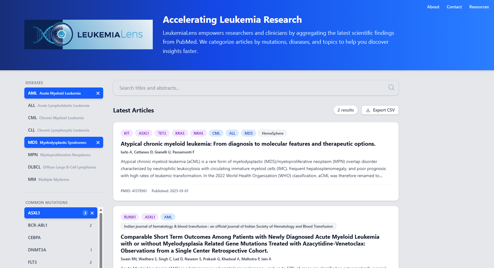

# LeukemiaLens

LeukemiaLens is a specialized research tracker designed to help researchers and clinicians stay updated with the latest scientific developments in leukemia. It aggregates articles from PubMed and enriches them with intelligent tagging for specific gene mutations, disease subtypes, and study topics.

## Screenshots
### Advanced Filtering & Study Topics


## Features

- **Automated Data Ingestion**: Scheduled workers fetch recent scientific articles from PubMed (NCBI) matching leukemia-related queries.
- **Smart Tagging**:
  - **Mutations**: Automatically detects common gene mutations (FLT3, NPM1, IDH1, TP53, KRAS, NRAS, etc.).
  - **Diseases**: Categorizes articles by subtype (AML, CML, ALL, CLL, MDS, MPN, DLBCL, MM).
  - **Study Topics**: Identifies key research areas like CAR-T, Cell Therapy, Immunotherapy, Clinical Trials, and Data Science/AI.
- **Ontology-Based Filtering**: Reference tables ensure consistent disease and mutation classification.
- **Advanced Search**: Filter by mutations, diseases, topics, author, journal, institution, and publication date.
- **CSV Export**: Export filtered results to CSV for further analysis.
- **Interactive Dashboard**:
  - Visual statistics of trending mutations and topics.
  - One-click filtering and resetting.
  - Direct links to full PubMed articles.

## Architecture

LeukemiaLens is built on a serverless Cloudflare Workers architecture:

```
┌─────────────────────────────────────────┐
│         Cloudflare Pages                │
│      (React + Vite Frontend)            │
└─────────────────┬───────────────────────┘
                  │
                  │ HTTPS
                  ▼
┌─────────────────────────────────────────┐
│      Cloudflare Workers (API)           │
│         (Hono Framework)                │
│                                         │
│  Endpoints:                             │
│  • GET /api/search                      │
│  • GET /api/export (CSV)                │
│  • GET /api/stats                       │
│  • GET /api/ontology                    │
│  • GET /api/study/:id                   │
└─────────────────┬───────────────────────┘
                  │
                  │
                  ▼
┌─────────────────────────────────────────┐
│       Cloudflare D1 Database            │
│           (SQLite)                      │
│                                         │
│  Tables:                                │
│  • studies                              │
│  • mutations                            │
│  • study_topics                         │
│  • ref_diseases (ontology)              │
│  • ref_mutations (ontology)             │
└─────────────────────────────────────────┘
                  ▲
                  │
                  │
┌─────────────────┴───────────────────────┐
│   Cloudflare Workers (Ingest)           │
│      (Scheduled CRON Job)               │
│                                         │
│  • Fetches from PubMed E-utilities      │
│  • Extracts metadata & tags             │
│  • Populates D1 database                │
└─────────────────────────────────────────┘
```

## Tech Stack

- **API**: Cloudflare Workers + Hono framework (TypeScript)
- **Ingestion**: Cloudflare Workers with scheduled CRON jobs
- **Database**: Cloudflare D1 (SQLite)
- **Frontend**: React + Vite + TailwindCSS
- **Hosting**: Cloudflare Pages
- **Data Source**: PubMed Entrez E-utilities API

## Database Schema

The application uses a relational schema with ontology tables for consistent classification:

### Core Tables
- **`studies`** - Main article metadata (title, abstract, journal, authors, publication date)
- **`mutations`** - Junction table linking studies to detected gene mutations
- **`study_topics`** - Junction table linking studies to research topics
- **`links`** - External links to full text sources

### Reference Tables (Ontology)
- **`ref_diseases`** - Authoritative list of disease subtypes (AML, ALL, CML, etc.)
- **`ref_mutations`** - Tracked gene mutations with categorization

See [`schema.sql`](schema.sql) for complete schema definition.

## Setup & Deployment

### Prerequisites

- **Node.js** 18+
- **Wrangler CLI**: `npm install -g wrangler`
- **Cloudflare Account** with:
  - Workers enabled
  - D1 database access
  - Pages deployment access

### 1. Database Setup

Create the D1 database:
```bash
wrangler d1 create leukemialens-db
```

Note the database ID from the output and update `wrangler.toml` files.

Apply the schema:
```bash
wrangler d1 execute leukemialens-db --file=schema.sql
```

### 2. API Worker Setup

Navigate to the API worker directory:
```bash
cd workers/api
```

Install dependencies:
```bash
npm install
```

Update `wrangler.toml` with your database ID.

Deploy:
```bash
wrangler deploy
```

### 3. Ingest Worker Setup

Navigate to the ingest worker directory:
```bash
cd workers/ingest
```

Install dependencies:
```bash
npm install
```

Set up environment variables:
```bash
# Add your NCBI API key (optional but recommended for higher rate limits)
wrangler secret put NCBI_API_KEY

# Set Cloudflare credentials for D1 API access (for backfill scripts)
wrangler secret put CLOUDFLARE_ACCOUNT_ID
wrangler secret put CLOUDFLARE_API_TOKEN
```

Update `wrangler.toml` with your database ID and configure the CRON schedule.

Deploy:
```bash
wrangler deploy
```

#### Running Backfill Scripts

To populate the database with historical data:

```bash
# Backfill articles
npx tsx scripts/backfill-production.ts

# Backfill study topics for existing articles
npx tsx scripts/backfill-topics.ts
```

### 4. Frontend Setup

Navigate to the frontend directory:
```bash
cd frontend
```

Install dependencies:
```bash
npm install
```

Update API endpoints in `src/App.tsx` if needed (currently points to production).

**Local Development:**
```bash
npm run dev
```
Frontend runs at `http://localhost:5173`

**Deploy to Cloudflare Pages:**
```bash
npm run build
wrangler pages deploy dist
```

Or connect your GitHub repository to Cloudflare Pages for automatic deployments.

## API Endpoints

### `GET /api/search`
Search and filter articles.

**Query Parameters:**
- `q` - Text search (title/abstract)
- `mutation` - Filter by gene mutations (comma-separated)
- `disease` - Filter by disease subtypes (comma-separated)
- `tag` - Filter by study topics (comma-separated)
- `author` - Filter by author name
- `journal` - Filter by journal name
- `institution` - Filter by institution/affiliation
- `year_start` - Filter by start year (YYYY or YYYY-MM-DD)
- `year_end` - Filter by end year (YYYY or YYYY-MM-DD)
- `limit` - Results per page (default: 50)
- `offset` - Pagination offset (default: 0)

### `GET /api/export`
Export filtered results as CSV. Accepts same query parameters as `/api/search`.

### `GET /api/stats`
Get statistics on mutations and topics.

**Response:**
```json
{
  "mutations": { "FLT3": 245, "NPM1": 198, ... },
  "tags": { "Clinical Trial": 89, "CAR-T": 56, ... }
}
```

### `GET /api/ontology`
Get reference lists of diseases and mutations.

### `GET /api/study/:id`
Get detailed information for a specific study by ID.

## Development

### Local Testing

**API Worker:**
```bash
cd workers/api
wrangler dev
```

**Ingest Worker:**
```bash
cd workers/ingest
wrangler dev
```

**Frontend:**
```bash
cd frontend
npm run dev
```

## License

This project is for research and educational purposes.

## Contributing

Contributions are welcome! Please open an issue or submit a pull request.
